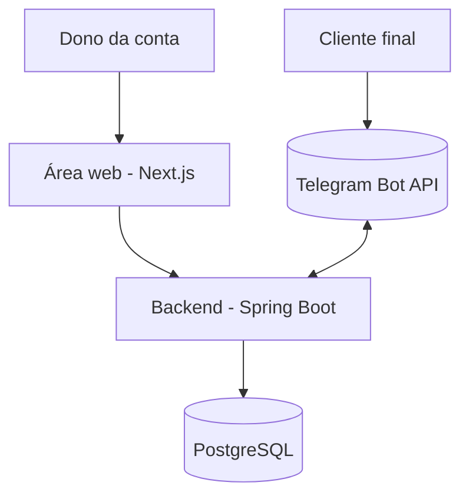
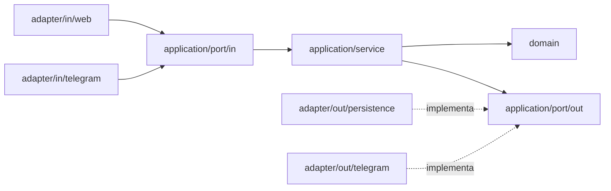

# Arquitetura — Plataforma de Agendamento por Bot (Telegram)

**Atualizado em:** 2026-06-25
**Baseado no ADR:** v1.0

> Snapshot **vivo** de como o sistema É agora. Toda mudança estrutural atualiza este arquivo
> no mesmo gatilho de uma entrada no `DECISIONS.md`.

## 1. Contexto (o que o sistema é)

SaaS multi-conta de agendamento. O **dono da conta** administra serviços, horários e vê a
agenda pela **área web** (Next.js). O **cliente final** agenda por conversa/calendário com
um **bot de Telegram** (um único bot da plataforma, deep link por conta). O backend
(Spring Boot, Hexagonal) concentra as regras e fala com o **PostgreSQL** e com a
**Telegram Bot API** (long polling).

## 2. Componentes (os módulos e suas fronteiras)

| Módulo | Responsabilidade | Pode importar de | NÃO pode importar de |
|--------|------------------|------------------|----------------------|
| `domain/**` | Entidades, enums, regras invioláveis, cálculo de slot/disponibilidade | nada de infra (Java puro) | Spring, JPA, Telegram, application, adapters |
| `application/port/in` | Interfaces de casos de uso (ex.: `AgendarUseCase`) | domain | adapters, infra |
| `application/port/out` | Interfaces de saída (ex.: `AgendamentoRepository`, `EnviarMensagemPort`) | domain | adapters, infra |
| `application/service` | Orquestra casos de uso usando ports | domain, port/in, port/out | adapters concretos, Spring annotations de web/jpa |
| `adapter/in/web` | Controllers REST + DTOs (`*Request`/`*Response`) + auth JWT | port/in, domain (p/ converter) | adapter/out, JPA |
| `adapter/in/telegram` | Recebe updates (long polling), aciona port/in | port/in | adapter/out persistência |
| `adapter/out/persistence` | JPA Entities + conversão Entity↔Domain | port/out, domain | adapter/in |
| `adapter/out/telegram` | Envia mensagens/calendário ao Telegram | port/out, domain | adapter/in |
| `frontend` (Next.js) | Área web; consome a API REST | API REST (HTTP) | banco (rede isolada) |

## 3. Invariantes de arquitetura

- [ ] O domínio não importa de infra (Spring/JPA/Telegram).
- [ ] Application enxerga só ports (interfaces), nunca adapters concretos.
- [ ] Injeção via construtor; sem `@Autowired` em campo.
- [ ] Enums em arquivos próprios (sem inner enum).
- [ ] Classes de domínio não trafegam entre camadas; usar DTOs no adapter web.
- [ ] Toda tabela tem `conta_id` (isolamento multi-tenant por coluna).
- [ ] `frontend` não está em `backend-net` → não enxerga o `db`.

## 4. Fitness Functions (regras vivas, checadas por fase)

| Fitness Function | Como checar (agente) | Status última revisão |
|------------------|----------------------|------------------------|
| Domínio não importa de Spring/JPA/Telegram | grep de imports em `domain/**` | — |
| Domínio sem `@Entity`/`@Component`/`@Autowired` | grep de anotações em `domain/**` | — |
| Application sem imports de adapters/`*Impl` | grep em `application/**` | — |
| Sem `@Autowired` em campo | grep `@Autowired` | — |
| Enums em arquivo próprio | grep inner `enum` | — |
| Testes de domínio sem `@SpringBootTest` | grep em testes de `domain/**` | — |
| `frontend` fora de `backend-net` | ler `docker-compose.yml` | — |
| Toda tabela com `conta_id` | revisar migrações Flyway | — |

## 5. Desvios conhecidos do ADR

- nenhum (projeto recém-iniciado).
