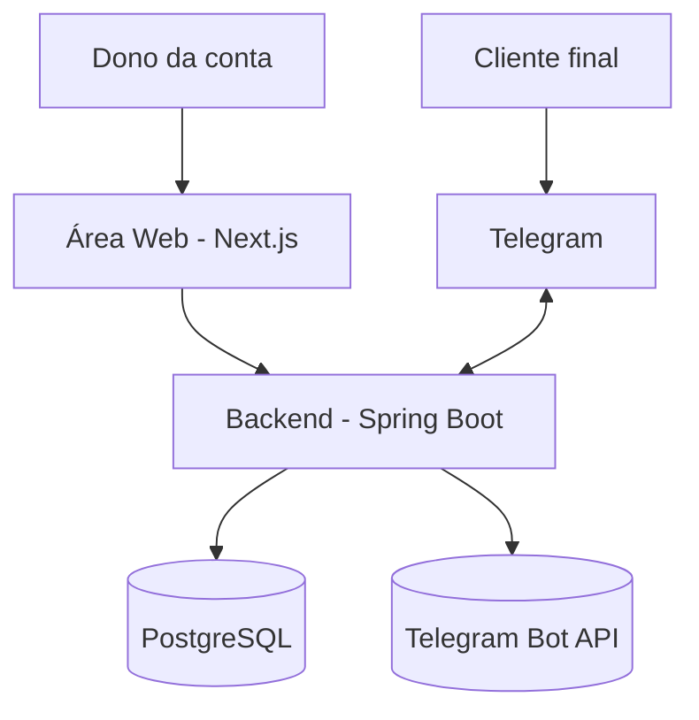
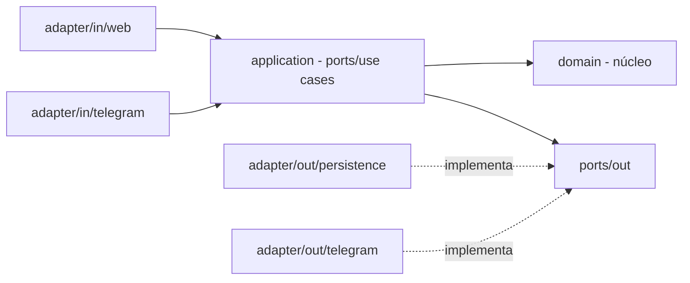

# Arquitetura — gerenciador-atendimentos

**Atualizado em:** 2026-06-24
**Baseado no ADR:** v1.0

## 1. Contexto (o que o sistema é)

SaaS multi-tenant de agendamento. O **dono da conta** se cadastra e opera uma área **web**
(Next.js): cria serviços, define horários de atendimento, vê o calendário de agendamentos,
copia o link do bot e cadastra clientes manualmente. O **cliente final** conversa com um
**bot de Telegram** (1 bot da plataforma + deep link por conta) para ver serviços, consultar
disponibilidade, agendar, cancelar e remarcar. O backend (Spring Boot, Hexagonal) concentra
as regras de agenda; PostgreSQL persiste tudo com isolamento por `conta_id`.

## 2. Componentes (os módulos e suas fronteiras)

| Módulo | Responsabilidade | Pode importar de | NÃO pode importar de |
|--------|------------------|------------------|----------------------|
| `domain` | Entidades, value objects, enums, regras invioláveis. Java puro. | (nada do projeto; só JDK) | Spring, JPA, Telegram, application, adapters |
| `application` | Use cases (ports/in), orquestração; define ports/out (interfaces). | `domain` | adapters concretos, Spring web, JPA, Telegram |
| `adapter/in/web` | Controllers REST, DTOs `*Request`/`*Response`, segurança (JWT). | `application` (ports/in), `domain` (só p/ mapear DTO) | `adapter/out/*`, JPA entities |
| `adapter/in/telegram` | Bot (long polling), comandos, teclados/calendário inline, roteia deep link → conta. | `application` (ports/in) | `adapter/out/*`, JPA entities |
| `adapter/out/persistence` | JPA entities + repositórios; mapeia Entity↔Domain; implementa ports/out de repositório. | `application` (ports/out), `domain` | `adapter/in/*` |
| `adapter/out/telegram` | Envio de mensagens ao Telegram; implementa port/out de notificação. | `application` (ports/out), `domain` | `adapter/in/*` |
| `frontend` (Next.js) | Área web (App Router, TS, Tailwind). Consome a API REST. | API REST (HTTP) | acesso direto ao banco |

## 3. Invariantes de arquitetura

- [ ] O `domain` não importa de infra (Spring, JPA, Telegram) nem de `application`/adapters.
- [ ] `application` e `domain` dependem só de **ports (interfaces)**, nunca de adapters concretos.
- [ ] Adapters não contêm regra de negócio — só tradução (HTTP/Telegram/SQL ↔ port).
- [ ] Classes de domínio não trafegam pela borda HTTP — só DTOs (`*Request`/`*Response`/`*Command`).
- [ ] Cada `enum` em arquivo próprio (sem inner enum).
- [ ] Injeção por construtor; sem `@Autowired` em campo.
- [ ] Toda tabela/entidade carrega `conta_id` (multi-tenant por coluna).
- [ ] O `frontend` nunca alcança o `db` (rede `backend-net` separada).

## 4. Fitness Functions (regras vivas, checadas por fase)

| Fitness Function | Como checar (agente) | Status última revisão |
|------------------|----------------------|------------------------|
| Domínio não importa de Spring/JPA/Telegram | grep de imports em `domain` | — |
| Application/domínio só dependem de ports | grep por `*Impl`/`*Adapter` em domain/application | — |
| Cada enum em arquivo próprio | grep `enum ` dentro de classes | — |
| Domínio não trafega na borda HTTP (só DTOs) | revisão dos controllers | — |
| Sem `@Autowired` em campo | grep `@Autowired` em campos | — |
| Toda entidade tem `conta_id` | revisão migrations/entities | — |
| Testes de domínio sem contexto Spring | grep `@SpringBootTest` em testes de `domain` | — |

## 5. Desvios conhecidos do ADR

- nenhum (projeto recém-iniciado).
